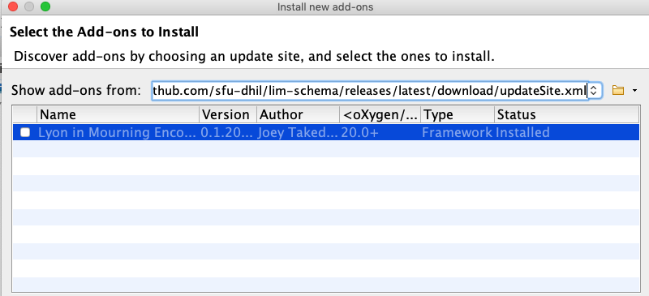

# Getting Started

## Setting up

Before working on the LiM documents, there are two pieces of software you will need to install: oXygen XML Editor and Github Desktop. You will also need a Github account.

* Provide the DHIL with your GitHub account username. If you do not have a GitHub account, you can create a free account here: [https://github.com/join](https://github.com/join).
* Download and install oXygen:[https://www.oxygenxml.com/xml_editor/download_oxygenxml_editor.html](https://www.oxygenxml.com/xml_editor/download_oxygenxml_editor.html). Members of the LiM team should contact the DHIL regarding license keys.
* Download and install the GitHub desktop client: [https://desktop.github.com/](https://desktop.github.com/)
## Setting up oXygen

### Using the Project File

* Open oXygen

* If this is your first time opening oXygen, you can close most of the panes on the right-hand and bottom side of your editor window. Make sure, however, that you retain the Project pane.
* In the toolbar, click `Project/Open Project` and navigate the `lim-data` directory.
* Open the `lim-schema.xpr` file and accept the popup notification from oXygen.

### Installing the LiM Encoding Tools/Schemas/Framework

* In the toolbar, click `Help/Install New Add Ons`: 
* In the text box, paste the following URL: `https://github.com/sfu-dhil/lim-schema/releases/latest/download/updateSite.xml` 

* Accept all of the notifications
* Restart oXygen
