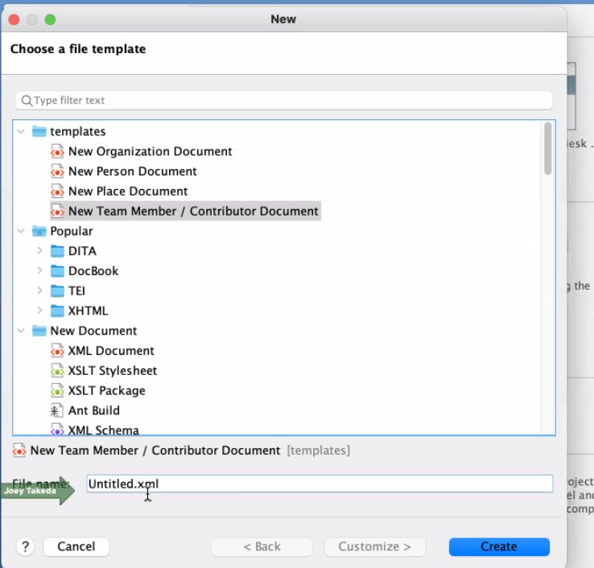
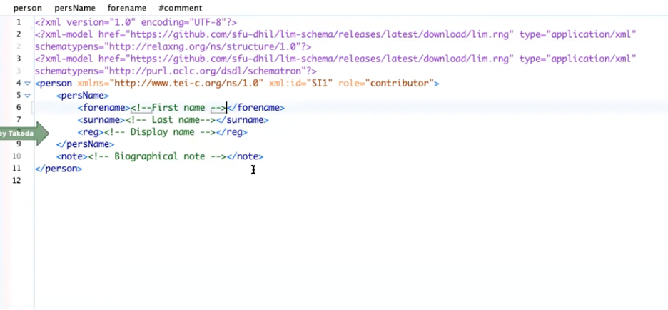

# Tagging People, Places, etc in Transcriptions

People, places, and other named entities are tagged in a similar fashion: each name is tagged using a distinguishing tag with an `@ref` attribute that points to the associated id. They also share a set of common rules: 
* They must not begin or end with spaces

* They must use the `@ref` to refer to the entity's record

* They can contain phrase- and word-level elements (i.e. `<choice>`, `<add>`, `<supplied>`, etc)

* They cannot nest: i.e. do not put a `<placeName>` inside of a `<persName>`.

## Contributors

To create a New Contributor, right click on the “contributors” folder, and then select “New” and then “File”.


Select the “templates” folder, and then click on “New Team Member/ Contributor Document”. Change the file names to the author’s initials (eg. SJI.xml).


To edit a template, replace the green text (the XML Comment) with your text. For instance, edit the forename, surname and display name. 


## People

Direct references to people should be tagged using the `<persName>` element that uses the `@ref` attribute to point to the person's id using the special `"prs:"` prefix. For instance: 
```
<persName ref="prs:1">Mr. Lyon</persName>
```
 Where `"prs:1"` refers to the person's id in the person database/spreadsheet.

As mentioned above, personal names should include any honourifics or titles, which may be editorially expanded: 
```
<persName ref="prs:1"><choice><abbr>Revt.</abbr><expan>Reverend</expan></choice> Mr. Lyon</persName>
```


Do not use `<persName>` to tag indirect references to people—e.g. The King; His mother; That Guy—as these are not personal names, but references to a person. In these cases, instead of `<persName>`, use the `<rs>` (referring string) element with `@type`=`"person"` alongside the `@ref` attribute that points to the person. For instance: 
```
<rs type="person" ref="prs:3">his mother</rs>
```


Groups of people that are not organizations (i.e. Parliament) or anonymous groups (the audience) can be tagged as if they are a single person: 
```
<rs type="person" ref="prs:4">Sisters</rs>
```


The above examples all derive from the first item of vol11_vol1; here is what it looks in its entirety: 
```
<title>Letter from the <persName ref="prs:1"><choice><abbr>Revt.</abbr><expan>Reverend</expan></choice> Mr. <persName>Lyon</persName></persName> to <rs type="person" ref="prs:3">his mother</rs><choice><abbr>+</abbr><expan>and</expan></choice><rs type="person" ref="prs:4">Sisters</rs></title>
```


## Places

See summary below.

## Events

TODO

## Objects

TODO
